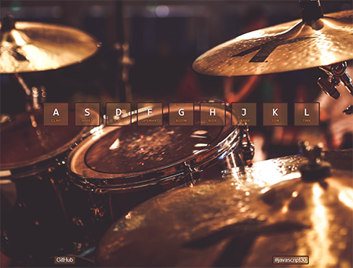
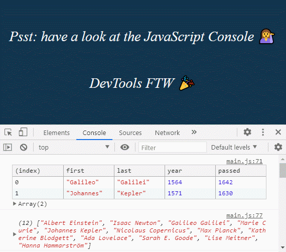
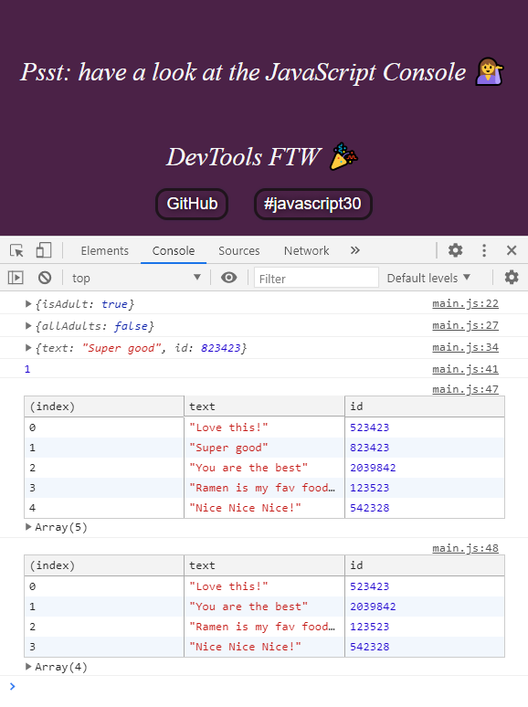

# [Wes Bos' 30 days Vanilla JS challenge](https://javascript30.com/)

## `No frameworks, no compilers, no fuss;`

### [Day 01: Drum Kit](https://2y2son4.github.io/drum-kit-day01/).

### **HTML**

- [`<kbd>`](https://developer.mozilla.org/en-US/docs/Web/HTML/Element/kbd)

#### **JS**

- Element.addEventLister()
- Element.classList
  - .add()
  - .remove()
- document.querySelector()
- document.querySelectorAll()
- [Event.keyCode](https://keycode.info/)
- audio
  - .play()
  - .currentTime
- Array.prototype.forEach

Click here to check the <strong>layout</strong>.

### **[Day 02: Clock](https://2y2son4.github.io/clock-day02)**.

#### **CSS**

- transform:
  - rotate()
- transform-origin
- transition-timing-function:
  - cubic-bezier

#### **JS**

- [Date()](https://developer.mozilla.org/en-US/docs/Web/JavaScript/Reference/Global_Objects/Date)
  - .getSeconds()
  - .getMinutes()
  - .getHours()
- Element.style
- [setInterval()](https://developer.mozilla.org/en-US/docs/Web/API/WindowOrWorkerGlobalScope/setInterval)

Click here to check the <strong>layout</strong>.

### **[Day 03: CSS variables](https://2y2son4.github.io/css-variables-day03)**.

#### **CSS**

- :root
- variables
- grid

#### **JS**

- Node list
- forEach
- [HTMLElement.dataset](https://developer.mozilla.org/en-US/docs/Web/API/HTMLOrForeignElement/dataset)
- document.documentElement

Click here to check the <strong>layout</strong>.

### **[Day 04: Array Cardio day 1](https://github.com/2y2son4/js-30-days-challenge/tree/main/04-array-cardio)**.

#### **JS**

- [console.table()](https://developer.mozilla.org/en-US/docs/Web/API/Console/table)
- .filter()
- .map()
- .reduce()
- .sort()
- [Array.from](https://developer.mozilla.org/en-US/docs/Web/JavaScript/Reference/Global_Objects/Array/from)
- Destructuring
- [Spread operator](https://developer.mozilla.org/en-US/docs/Web/JavaScript/Reference/Operators/Spread_syntax)
- Ternary conditional

Click here to check the <strong>console</strong>.

### **[Day 05: Flex panels](https://2y2son4.github.io/flex-portfolio)**.

#### **CSS**

- [flexbox](https://css-tricks.com/snippets/css/a-guide-to-flexbox/)
- :first-child
- :last-child
- :nth-child()

#### **JS**

- Element.classList.toggle()
- Document.querySelectorAll()
- .forEach()

Click here to check the <strong>layout</strong>.

### **[Day 06: Ajax type ahead](https://2y2son4.github.io/ajax-exercise-day06/)**.

#### **JS**

- fetch()
- .then() → promises.
- .match()
- .replace()
- .join()
- Regular expressions

Click here to check the <strong>search</strong>.

### **[Day 07: Array Cardio day 2](https://github.com/2y2son4/js-30-days-challenge/tree/main/07-array-cardio-2)**.

#### **JS**

- [.some()](https://developer.mozilla.org/en-US/docs/Web/JavaScript/Reference/Global_Objects/Array/some)
- [.every()](https://developer.mozilla.org/en-US/docs/Web/JavaScript/Reference/Global_Objects/Array/every)
- [.find()](https://developer.mozilla.org/en-US/docs/Web/JavaScript/Reference/Global_Objects/Array/find)
- [.findIndex()](https://developer.mozilla.org/en-US/docs/Web/JavaScript/Reference/Global_Objects/Array/findIndex)
- [.slice()](https://developer.mozilla.org/en-US/docs/Web/JavaScript/Reference/Global_Objects/Array/slice)
- [Date().getFullYear()](https://developer.mozilla.org/en-US/docs/Web/JavaScript/Reference/Global_Objects/Date/getFullYear)

Click here to check the <strong>console</strong>.

### **[Day 08: Fun with HTML `<canvas>`](https://2y2son4.github.io/fun-with-canvas/)**.

#### **JS**

- [HTMLCanvasElement.getContext()](https://developer.mozilla.org/en-US/docs/Web/API/HTMLCanvasElement/getContext)
  - [CanvasRenderingContext2d](https://developer.mozilla.org/en-US/docs/Web/API/CanvasRenderingContext2D)
    - [strokeStyle](https://developer.mozilla.org/en-US/docs/Web/API/CanvasRenderingContext2D/strokeStyle)
    - [lineJoin](https://developer.mozilla.org/en-US/docs/Web/API/CanvasRenderingContext2D/lineJoin)
    - [lineCap](https://developer.mozilla.org/en-US/docs/Web/API/CanvasRenderingContext2D/lineCap)
    - [lineWidth](https://developer.mozilla.org/en-US/docs/Web/API/CanvasRenderingContext2D/lineWidth)
    - [.beginPath()](https://developer.mozilla.org/en-US/docs/Web/API/CanvasRenderingContext2D/beginPath)
    - [.moveTo()](https://developer.mozilla.org/en-US/docs/Web/API/CanvasRenderingContext2D/moveTo)
    - [.lineTo()](https://developer.mozilla.org/en-US/docs/Web/API/CanvasRenderingContext2D/lineTo)
    - [.stroke()](https://developer.mozilla.org/en-US/docs/Web/API/CanvasRenderingContext2D/stroke)

Click here to check the <strong>result</strong>.

