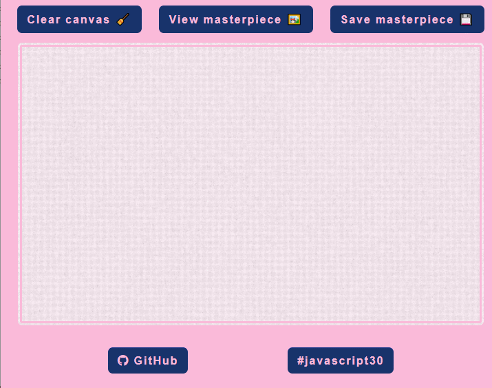
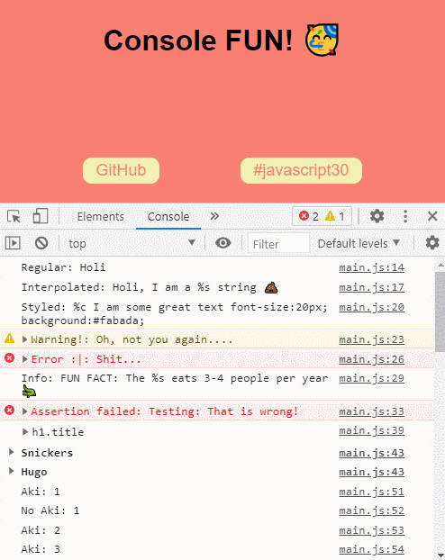
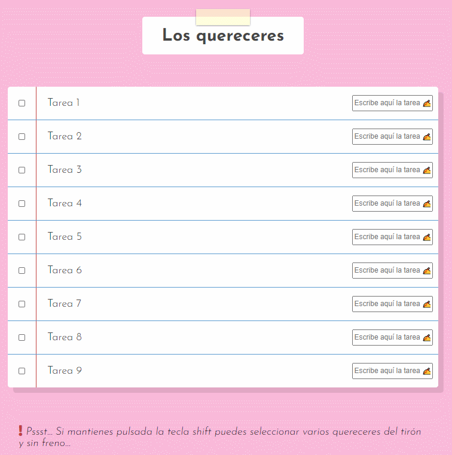
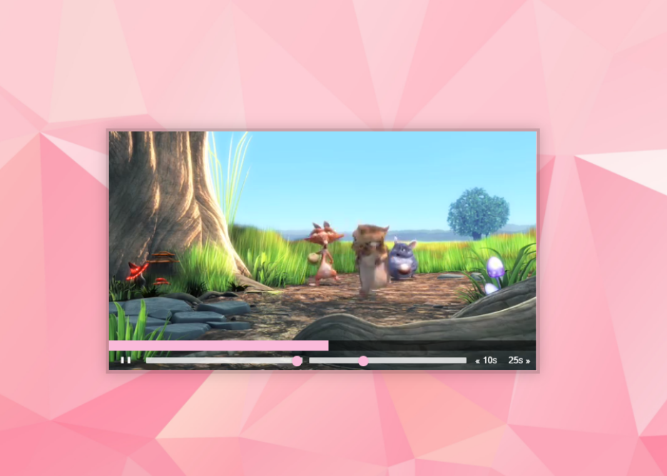
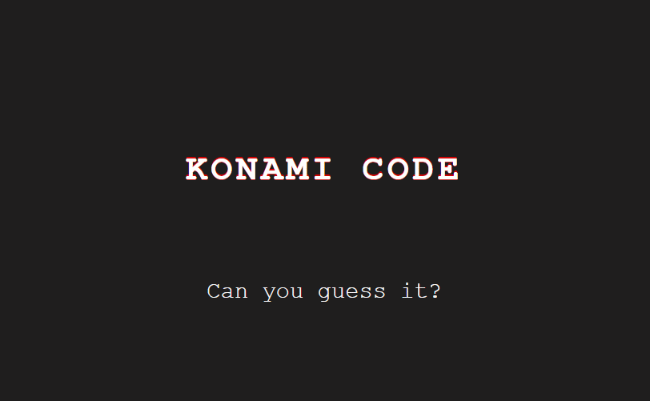
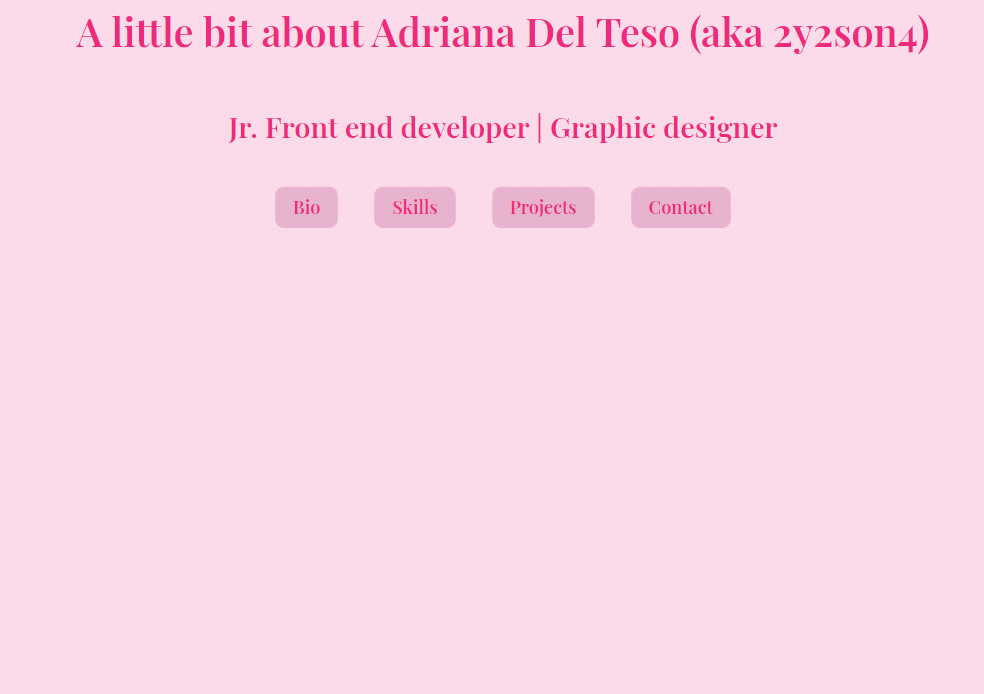
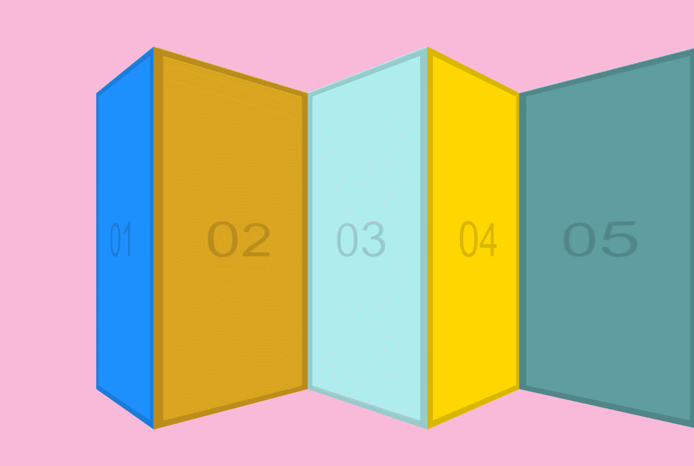

# [Wes Bos' 30 days Vanilla JS challenge](https://javascript30.com/)

## `No frameworks, no compilers, no fuss;`

- [01](#day-01) | [02](#day-02-clock) | [03](#day-03-css-variables) | [04](#day-04-array-cardio-day-1) | [05](#day-05-flex-panels) | [06](#day-06-ajax-type-ahead) |
- [07](#day-07-array-cardio-day-2) | [08](#day-08-fun-with-html-canvas) | [09](#day-09-console-treats-and-tricks) | [10](#day-10-checkboxes-task-list) | [11](#day-11-custom-html-video-player) | [12](#day-12-konami-code) |
- [13](#day-13-chiquitos-slide-in-on-scroll-images) | [14](#day-14-objects-and-arrays-cardio-copy-vs-reference) | [15](#day-) | [16](#day-16-css-shadow-effect) | [17](#day-17-sort-list) | [18](#day-18-reduce-and-calculate-total-time) |
- [19](#day-19-unreal-webcam) | [20](#day-20-speech-recognition) | [21](#day-21-geolocation) | [22](#day-22-follow-along-links) | [23](#day-23-the-voicenator) | [24](#day-24-sticky-nav) |
- [25](#day-25-capture-propagation-and-bubbling) | [26](#day-26-follow-along-dropdown) | [27](#day-27-click-and-drag) | [28](#day-28-video-speed-controller) ~~| [29](#day-) | [30](#day-) |~~

### [Day 01: Drum Kit](https://2y2son4.github.io/drum-kit-day01/).

#### **HTML**

- [`<kbd>`](https://developer.mozilla.org/en-US/docs/Web/HTML/Element/kbd)

#### **JS**

- Element.addEventLister()
- Element.classList
  - .add()
  - .remove()
- document.querySelector()
- document.querySelectorAll()
- [Event.keyCode](https://keycode.info/)
- audio
  - .play()
  - .currentTime
- Array.prototype.forEach

Click here to check the <strong>layout</strong>.

[Volver al inicio](#wes-Bos-30-days-vanilla-js-challenge).

### **[Day 02: Clock](https://2y2son4.github.io/clock-day02)**.

#### **CSS**

- transform:
  - rotate()
- transform-origin
- transition-timing-function:
  - cubic-bezier

#### **JS**

- [Date()](https://developer.mozilla.org/en-US/docs/Web/JavaScript/Reference/Global_Objects/Date)
  - .getSeconds()
  - .getMinutes()
  - .getHours()
- Element.style
- [setInterval()](https://developer.mozilla.org/en-US/docs/Web/API/WindowOrWorkerGlobalScope/setInterval)

Click here to check the <strong>layout</strong>.

[Volver al inicio](#wes-Bos-30-days-vanilla-js-challenge).

### **[Day 03: CSS variables](https://2y2son4.github.io/css-variables-day03)**.

#### **CSS**

- :root
- variables
- grid

#### **JS**

- Node list
- forEach
- [HTMLElement.dataset](https://developer.mozilla.org/en-US/docs/Web/API/HTMLOrForeignElement/dataset)
- document.documentElement

Click here to check the <strong>layout</strong>.

[Volver al inicio](#wes-Bos-30-days-vanilla-js-challenge).

### **[Day 04: Array Cardio day 1](https://github.com/2y2son4/js-30-days-challenge/tree/main/04-array-cardio)**.

#### **JS**

- [console.table()](https://developer.mozilla.org/en-US/docs/Web/API/Console/table)
- .filter()
- .map()
- .reduce()
- .sort()
- [Array.from](https://developer.mozilla.org/en-US/docs/Web/JavaScript/Reference/Global_Objects/Array/from)
- Destructuring
- [Spread operator](https://developer.mozilla.org/en-US/docs/Web/JavaScript/Reference/Operators/Spread_syntax)
- Ternary conditional

Click here to check the <strong>console</strong>.

[Volver al inicio](#wes-Bos-30-days-vanilla-js-challenge).

### **[Day 05: Flex panels](https://2y2son4.github.io/flex-portfolio)**.

#### **CSS**

- [flexbox](https://css-tricks.com/snippets/css/a-guide-to-flexbox/)
- :first-child
- :last-child
- :nth-child()

#### **JS**

- Element.classList.toggle()
- Document.querySelectorAll()
- .forEach()

Click here to check the <strong>layout</strong>.

[Volver al inicio](#wes-Bos-30-days-vanilla-js-challenge).

### **[Day 06: Ajax type ahead](https://2y2son4.github.io/ajax-exercise-day06/)**.

#### **JS**

- fetch()
- .then() → promises.
- .match()
- .replace()
- .join()
- Regular expressions

Click here to check the <strong>search</strong>.

[Volver al inicio](#wes-Bos-30-days-vanilla-js-challenge).

### **[Day 07: Array Cardio day 2](https://github.com/2y2son4/js-30-days-challenge/tree/main/07-array-cardio-2)**.

#### **JS**

- [.some()](https://developer.mozilla.org/en-US/docs/Web/JavaScript/Reference/Global_Objects/Array/some)
- [.every()](https://developer.mozilla.org/en-US/docs/Web/JavaScript/Reference/Global_Objects/Array/every)
- [.find()](https://developer.mozilla.org/en-US/docs/Web/JavaScript/Reference/Global_Objects/Array/find)
- [.findIndex()](https://developer.mozilla.org/en-US/docs/Web/JavaScript/Reference/Global_Objects/Array/findIndex)
- [.slice()](https://developer.mozilla.org/en-US/docs/Web/JavaScript/Reference/Global_Objects/Array/slice)
- [Date().getFullYear()](https://developer.mozilla.org/en-US/docs/Web/JavaScript/Reference/Global_Objects/Date/getFullYear)

Click here to check the <strong>console</strong>.

[Volver al inicio](#wes-Bos-30-days-vanilla-js-challenge).

### **[Day 08: Fun with HTML canvas](https://2y2son4.github.io/fun-with-canvas/)**.

#### **HTML**

-`<canvas`

#### **JS**

- [HTMLCanvasElement.getContext()](https://developer.mozilla.org/en-US/docs/Web/API/HTMLCanvasElement/getContext)
  - [CanvasRenderingContext2d](https://developer.mozilla.org/en-US/docs/Web/API/CanvasRenderingContext2D)
    - [strokeStyle](https://developer.mozilla.org/en-US/docs/Web/API/CanvasRenderingContext2D/strokeStyle)
    - [lineJoin](https://developer.mozilla.org/en-US/docs/Web/API/CanvasRenderingContext2D/lineJoin)
    - [lineCap](https://developer.mozilla.org/en-US/docs/Web/API/CanvasRenderingContext2D/lineCap)
    - [lineWidth](https://developer.mozilla.org/en-US/docs/Web/API/CanvasRenderingContext2D/lineWidth)
    - [.beginPath()](https://developer.mozilla.org/en-US/docs/Web/API/CanvasRenderingContext2D/beginPath)
    - [.moveTo()](https://developer.mozilla.org/en-US/docs/Web/API/CanvasRenderingContext2D/moveTo)
    - [.lineTo()](https://developer.mozilla.org/en-US/docs/Web/API/CanvasRenderingContext2D/lineTo)
    - [.stroke()](https://developer.mozilla.org/en-US/docs/Web/API/CanvasRenderingContext2D/stroke)

Click here to check the <strong>result</strong>.

[Volver al inicio](#wes-Bos-30-days-vanilla-js-challenge)

### **[Day 09: Console treats and tricks](https://github.com/2y2son4/js-30-days-challenge/tree/main/09-dev-tools-tricks)**.

#### **JS**

- [console.log()](https://developer.mozilla.org/en-US/docs/Web/API/Console/log)
  - Regular
  - Interpolated
  - Styled
- [console.warn()]()
- [console.error()](https://developer.mozilla.org/en-US/docs/Web/API/Console/error)
- [console.info()](https://developer.mozilla.org/en-US/docs/Web/API/Console/info)
- [console.assert()](https://developer.mozilla.org/en-US/docs/Web/API/console/assert)
- [console.dir()](https://developer.mozilla.org/en-US/docs/Web/API/Console/dir)
- [console.group()](https://developer.mozilla.org/en-US/docs/Web/API/Console/group) | [console.groupEnd()](https://developer.mozilla.org/en-US/docs/Web/API/Console/groupEnd)
- [console.groupCollapsed()](https://developer.mozilla.org/en-US/docs/Web/API/Console/groupCollapsed)
- [console.count()](https://developer.mozilla.org/en-US/docs/Web/API/Console/count)
- [console.time()](https://developer.mozilla.org/en-US/docs/Web/API/Console/time) | [console.timeEnd()](https://developer.mozilla.org/en-US/docs/Web/API/Console/timeEnd)
- [console.table()](https://developer.mozilla.org/en-US/docs/Web/API/Console/table)

Click here to check the <strong>console</strong>.

[Volver al inicio](#wes-Bos-30-days-vanilla-js-challenge).

### **[Day 10: Checkboxes task list](https://2y2son4.github.io/customizable-task-list/)**.

#### **JS**

- [.forEach()](https://developer.mozilla.org/en-US/docs/Web/JavaScript/Reference/Global_Objects/Array/forEach)
- [for...of](https://developer.mozilla.org/en-US/docs/Web/JavaScript/Reference/Statements/for...of)
- [localStorage.setItem()](https://developer.mozilla.org/en-US/docs/Web/API/Storage/setItem)
- [localStorage.getItem()](https://developer.mozilla.org/en-US/docs/Web/API/Storage/getItem)
- [JSON.stringify()](https://developer.mozilla.org/en-US/docs/Web/JavaScript/Reference/Global_Objects/JSON/stringify)

Click here to check the <strong>layout</strong>.

[Volver al inicio](#wes-Bos-30-days-vanilla-js-challenge).

### [Day 11: Custom HTML Video Player](https://2y2son4.github.io/simple-js-html-videoplayer/).

#### **HTML**

- [`<video>`](https://developer.mozilla.org/en-US/docs/Web/HTML/Element/video)

#### **JS**

- [parseFloat()](https://developer.mozilla.org/en-US/docs/Web/JavaScript/Reference/Global_Objects/parseFloat)
- [video.pause | video.play() | ... ](https://developer.mozilla.org/en-US/docs/Web/API/HTMLMediaElement)

Click here to check the <strong>layout</strong>.

[Volver al inicio](#wes-Bos-30-days-vanilla-js-challenge).

### **[Day 12: KONAMI Code](https://2y2son4.github.io/konami-code)**.

#### **JS**

- [push()](https://developer.mozilla.org/en-US/docs/Web/JavaScript/Reference/Global_Objects/Array/push)
- [splice()](https://developer.mozilla.org/en-US/docs/Web/JavaScript/Reference/Global_Objects/Array/splice)
- [cornify_add()](https://github.com/Cornify/Cornify)

Click here to check the <strong>layout</strong>.

[Volver al inicio](#wes-Bos-30-days-vanilla-js-challenge).

### **[Day 13: Chiquito's slide in on scroll images](https://2y2son4.github.io/chiquitos-shrine)**.

#### **JS**

- setTimeout()
- clearTimeout()
- scrollY
- offsetTop

Click here to check the <strong>layout</strong>.

[Volver al inicio](#wes-Bos-30-days-vanilla-js-challenge).

### **[Day 14: Objects and arrays cardio (copy vs reference)](https://github.com/2y2son4/js-30-days-challenge/tree/main/14-objects-and-arrays)**.

#### **JS**

- [.slice()](https://developer.mozilla.org/en-US/docs/Web/JavaScript/Reference/Global_Objects/Array/slice)
- [.concat()](https://developer.mozilla.org/en-US/docs/Web/JavaScript/Reference/Global_Objects/Array/concat)
- [...](https://developer.mozilla.org/en-US/docs/Web/JavaScript/Reference/Operators/Spread_syntax)
- [Array.from()](https://developer.mozilla.org/en-US/docs/Web/JavaScript/Reference/Global_Objects/Array/from)
- [Object.assign()](https://developer.mozilla.org/en-US/docs/Web/JavaScript/Reference/Global_Objects/Object/assign)
- [JSON.parse()](https://developer.mozilla.org/en-US/docs/Web/JavaScript/Reference/Global_Objects/JSON/parse)
- [JSON.stringify()](https://developer.mozilla.org/en-US/docs/Web/JavaScript/Reference/Global_Objects/JSON/stringify)

[Volver al inicio](#wes-Bos-30-days-vanilla-js-challenge).

### [Day 15: Local storage and event delegation](https://github.com/2y2son4/js-30-days-challenge/tree/main/15-local-storage-and-event-delegation).

#### **JS**

- [localStorage.setItem()](https://developer.mozilla.org/en-US/docs/Web/API/Storage/setItem)
- [localStorage.getItem()](https://developer.mozilla.org/en-US/docs/Web/API/Storage/getItem)
- [JSON.stringify()](https://developer.mozilla.org/en-US/docs/Web/JavaScript/Reference/Global_Objects/JSON/stringify)
- [JSON.parse()](https://developer.mozilla.org/en-US/docs/Web/JavaScript/Reference/Global_Objects/JSON/parse)
- [event.preventDefault()](https://developer.mozilla.org/en-US/docs/Web/API/Event/preventDefault)

Click here to check the <strong>layout</strong>.

[Volver al inicio](#wes-Bos-30-days-vanilla-js-challenge).

### [Day 16: CSS shadow effect](https://github.com/2y2son4/js-30-days-challenge/tree/main/16-css-effects).

#### **JS**

- offsetWidth, offsetHeight, offsetX, offsetY, offLeft, offsetTop...

[Volver al inicio](#wes-Bos-30-days-vanilla-js-challenge).

### [Day 17: Sort list](https://github.com/2y2son4/js-30-days-challenge/tree/main/17-sort-list).

#### **JS**

- [.replace()](https://developer.mozilla.org/en-US/docs/Web/JavaScript/Reference/Global_Objects/String/replace)
- [.sort()](https://developer.mozilla.org/en-US/docs/Web/JavaScript/Reference/Global_Objects/Array/sort)
- [.map()](https://developer.mozilla.org/en-US/docs/Web/JavaScript/Reference/Global_Objects/Array/map)
- [.join()](https://developer.mozilla.org/en-US/docs/Web/JavaScript/Reference/Global_Objects/Array/join)

[Volver al inicio](#wes-Bos-30-days-vanilla-js-challenge).

### [Day 18: Reduce and calculate total time](https://github.com/2y2son4/js-30-days-challenge/tree/main/18-reduce).

#### **JS**

- [.dataset](https://developer.mozilla.org/en-US/docs/Web/API/HTMLOrForeignElement/dataset)
- [.split()](https://developer.mozilla.org/en-US/docs/Web/JavaScript/Reference/Global_Objects/String/split)
- [parseFloat()](https://developer.mozilla.org/en-US/docs/Web/JavaScript/Reference/Global_Objects/parseFloat)
- [.reduce()](https://developer.mozilla.org/en-US/docs/Web/JavaScript/Reference/Global_Objects/Array/Reduce)

[Volver al inicio](#wes-Bos-30-days-vanilla-js-challenge).

### [Day 19: Unreal Webcam](https://2y2son4.github.io/photobooth-functastic/).

#### **HTML**

- [`<video>`](https://developer.mozilla.org/en-US/docs/Web/HTML/Element/video)

#### **JS**

- [canvas.getContext('2d')](https://developer.mozilla.org/en-US/docs/Web/API/HTMLCanvasElement/getContext)
- [.getUserMedia()](https://developer.mozilla.org/en-US/docs/Web/API/MediaDevices/getUserMedia)
- [.catch()](https://developer.mozilla.org/en-US/docs/Web/JavaScript/Reference/Global_Objects/Promise/catch)
- [.play()](https://developer.mozilla.org/en-US/docs/Web/API/HTMLMediaElement/play)
- [.toDataURL](https://developer.mozilla.org/en-US/docs/Web/API/HTMLCanvasElement/toDataURL)
- [.createElement()](https://developer.mozilla.org/en-US/docs/Web/API/Document/createElement)
- [.setAttribute()](https://developer.mozilla.org/en-US/docs/Web/API/Element/setAttribute)
- [.insertBefore()](https://developer.mozilla.org/en-US/docs/Web/API/Node/insertBefore)
- [.firstChild](https://developer.mozilla.org/en-US/docs/Web/API/Node/firstChild)

  [Volver al inicio](#wes-Bos-30-days-vanilla-js-challenge).

### [Day 20: Speech Recognition](https://github.com/2y2son4/js-30-days-challenge/tree/main/20-speech-recognition).

#### **JS**

- [SpeechRecognition()](https://developer.mozilla.org/en-US/docs/Web/API/SpeechRecognition)
  - [.interimResults](https://developer.mozilla.org/en-US/docs/Web/API/SpeechRecognition/interimResults)
  - [.lang](https://developer.mozilla.org/en-US/docs/Web/API/SpeechRecognition/lang)
- [.createElement()](https://developer.mozilla.org/en-US/docs/Web/API/Document/createElement)
- [.appendChild()](https://developer.mozilla.org/en-US/docs/Web/API/Node/appendChild)
- [.map()](https://developer.mozilla.org/en-US/docs/Web/JavaScript/Reference/Global_Objects/Array/map)
- [.join()](https://developer.mozilla.org/en-US/docs/Web/JavaScript/Reference/Global_Objects/Array/join)
- [.replace()](https://developer.mozilla.org/en-US/docs/Web/JavaScript/Reference/Global_Objects/String/replace)
- [.textContent()](https://developer.mozilla.org/en-US/docs/Web/API/Node/textContent)

[Volver al inicio](#wes-Bos-30-days-vanilla-js-challenge).

### [Day 21: Geolocation](https://github.com/2y2son4/js-30-days-challenge/tree/main/21-geolocation).

#### **JS**

- [.geolocation.watchPosition()](https://developer.mozilla.org/en-US/docs/Web/API/Geolocation/watchPosition)

[Volver al inicio](#wes-Bos-30-days-vanilla-js-challenge).

### [Day 22: Follow along links](https://github.com/2y2son4/js-30-days-challenge/tree/main/22-follow-along-links).

#### **JS**

- [getBoundingClientRect()](https://developer.mozilla.org/en-US/docs/Web/API/Element/getBoundingClientRect)

Click here to check the <strong>layout</strong>.

[Volver al inicio](#wes-Bos-30-days-vanilla-js-challenge).

### [Day 23: The Voicenator](https://github.com/2y2son4/js-30-days-challenge/tree/main/23-speech-synthesis).

#### **JS**

- [SpeechSynthesisUtterance()](https://developer.mozilla.org/en-US/docs/Web/API/SpeechSynthesisUtterance/SpeechSynthesisUtterance)
- [speechSynthesis](https://developer.mozilla.org/en-US/docs/Web/API/SpeechSynthesis)
  - [.cancel()](https://developer.mozilla.org/en-US/docs/Web/API/SpeechSynthesis/cancel)
  - [.getVoices()](https://developer.mozilla.org/en-US/docs/Web/API/SpeechSynthesis/getVoices)
- [.find()](https://developer.mozilla.org/en-US/docs/Web/JavaScript/Reference/Global_Objects/Array/find)
- [.bind()](https://developer.mozilla.org/en-US/docs/Web/JavaScript/Reference/Global_Objects/Function/bind)

[Volver al inicio](#wes-Bos-30-days-vanilla-js-challenge).

### [Day 24: Sticky nav](https://github.com/2y2son4/js-30-days-challenge/tree/main/24-sticky-nav).

#### **JS**

- [Element.classList](https://developer.mozilla.org/en-US/docs/Web/API/Element/classList)
  - .add()
  - .remove()
- [.offsetTop](https://developer.mozilla.org/en-US/docs/Web/API/HTMLElement/offsetTop)
- [.scrollY](https://developer.mozilla.org/en-US/docs/Web/API/Window/scrollY)

[Volver al inicio](#wes-Bos-30-days-vanilla-js-challenge).

### [Day 25: capture, propagation and bubbling](https://github.com/2y2son4/js-30-days-challenge/tree/main/25-capture-propagation-bubbling).

#### **JS**

- [addEventListener](https://developer.mozilla.org/en-US/docs/Web/API/EventTarget/addEventListener)
- [ev.stopPropagation()](https://developer.mozilla.org/en-US/docs/Web/API/Event/stopPropagation)

[Volver al inicio](#wes-Bos-30-days-vanilla-js-challenge).

### [Day 26: Follow along dropdown](https://github.com/2y2son4/js-30-days-challenge/tree/main/26-follow-along-dropdown).

#### **JS**

- [Element.classList](https://developer.mozilla.org/en-US/docs/Web/API/Element/classList)
- [getBoundingClientRect()](https://developer.mozilla.org/en-US/docs/Web/API/Element/getBoundingClientRect)
- [.style.setProperty()](https://developer.mozilla.org/en-US/docs/Web/API/CSSStyleDeclaration/setProperty)

Click here to check the <strong>layout</strong>.

[Volver al inicio](#wes-Bos-30-days-vanilla-js-challenge).

### [Day 27: Click and drag](https://github.com/2y2son4/js-30-days-challenge/tree/main/27-click-and-drag).

#### **JS**

- [.pageX](https://developer.mozilla.org/en-US/docs/Web/API/MouseEvent/pageX)
- [.offsetLeft](https://developer.mozilla.org/en-US/docs/Web/API/HTMLElement/offsetLeft)
- [mousedown](https://developer.mozilla.org/en-US/docs/Web/API/Element/mousedown_event)
- [mouseleave](https://developer.mozilla.org/en-US/docs/Web/API/Element/mouseleave_event)
- [mouseup](https://developer.mozilla.org/en-US/docs/Web/API/Element/mouseup_event)
- [mousemove](https://developer.mozilla.org/en-US/docs/Web/API/Element/mousemove_event)

Click here to check the <strong>layout</strong>.

[Volver al inicio](#wes-Bos-30-days-vanilla-js-challenge).

### [Day 28: Video speed controller](https://github.com/2y2son4/js-30-days-challenge/tree/main/28-video-speed-controller).

#### **JS**

[Volver al inicio](#wes-Bos-30-days-vanilla-js-challenge).

### [Day 29: ]().

#### **JS**

[Volver al inicio](#wes-Bos-30-days-vanilla-js-challenge).

### [Day 30: ]().

#### **JS**

[Volver al inicio](#wes-Bos-30-days-vanilla-js-challenge).
